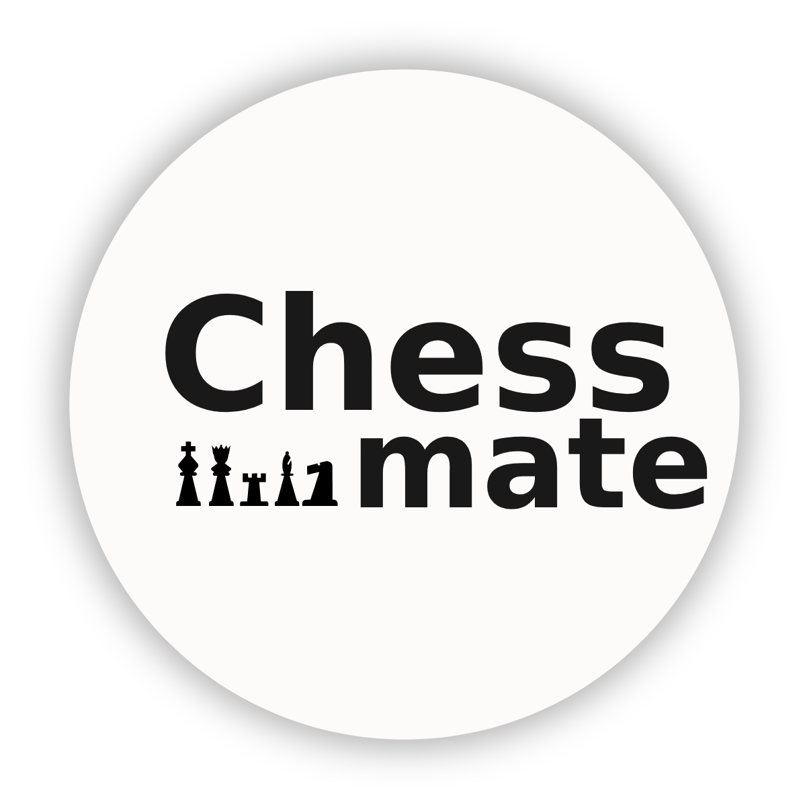
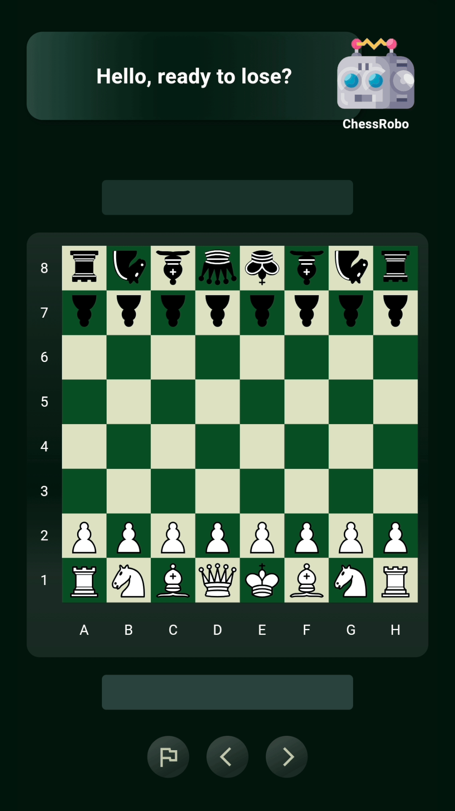
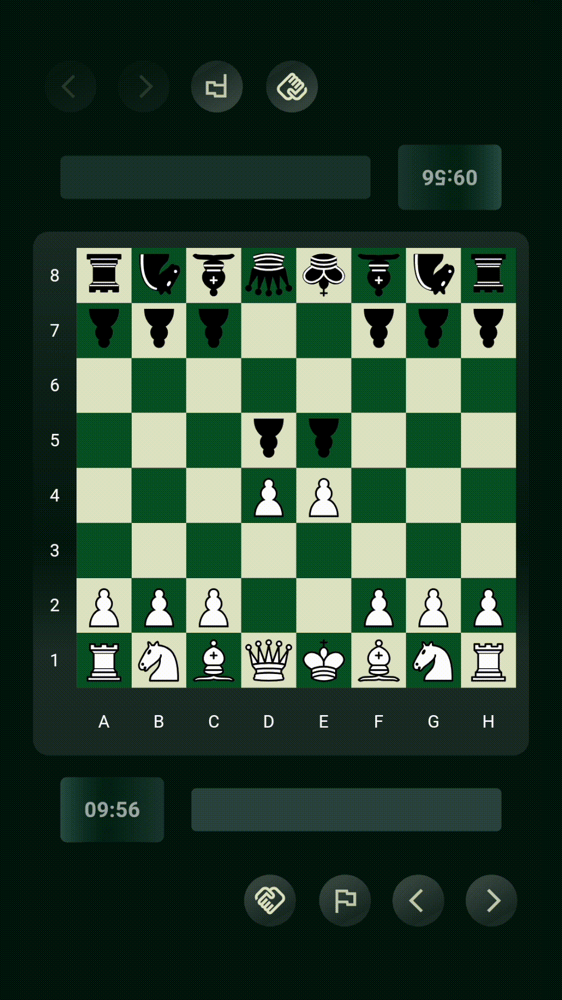
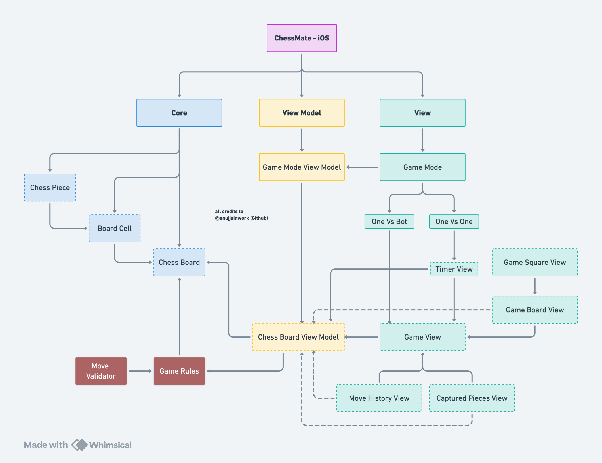
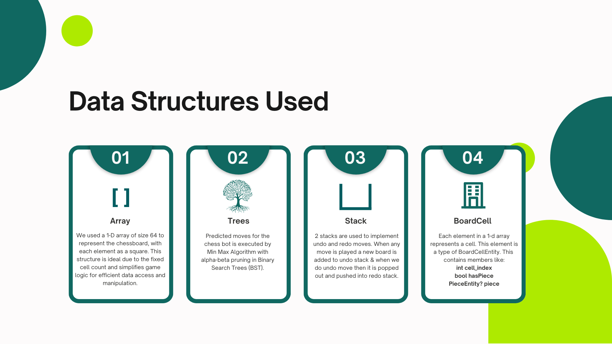
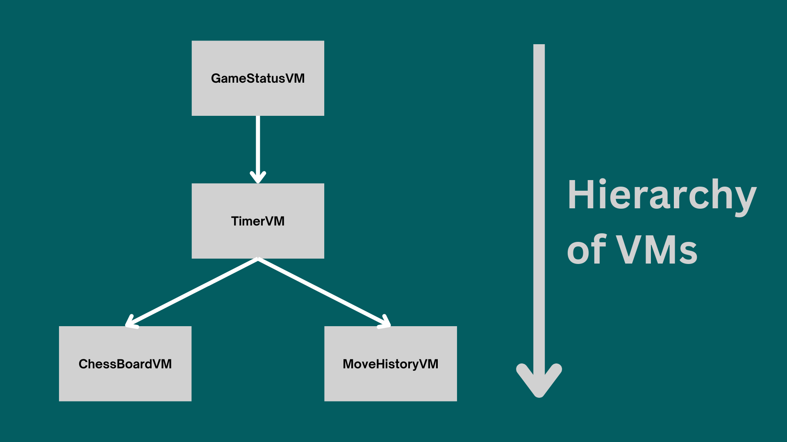

<table>
  <tr>
    <td>
      
    </td>
    <td>
      <h1><b>ChessMate - Ultimate Chess Experience</b></h1>
    </td>
  </tr>
</table>

---

## Live Demo - ChessMate in Action

  
  
  
  

---

## View Model Logic

> *Understanding the architecture of ChessMate*  

  
    
  
    
  

---

## Installation & Setup

### Prerequisites  
Ensure you have the following installed:  
- **Xcode 15+** – [Download Xcode](https://developer.apple.com/xcode/)  
- **iOS 17+ Simulator or Device**  
- **Swift Package Manager (SPM)** (included in Xcode)  

---

### Clone the Repository  
~~~sh
git clone https://github.com/yourusername/MyChessApp.git
cd MyChessApp
~~~

---

### Open in Xcode  
1. Open `MyChessApp.xcodeproj` in Xcode.  
2. Select your preferred **Simulator** or **Real Device**.  
3. Ensure the **Signing & Capabilities** settings are properly configured.  

---

### Run the App  
Click the **Run** button in Xcode or use:  
~~~sh
xcodebuild -scheme MyChessApp -destination 'platform=iOS Simulator,name=iPhone 15'  
~~~

---

### Managing Dependencies  
This project uses **Swift Package Manager (SPM)** for dependencies. If any package is missing:  
1. Open Xcode > **File** > **Packages** > **Update to Latest Package Versions**  
2. Alternatively, run:  
   ~~~sh
   swift package resolve
   ~~~
---

## Features

 **Play 1v1 Locally** – Challenge a friend on the same device.  
 **Play Against AI (1vBot)** – Battle a chess bot with smart AI.  
 **Beautiful UI & Smooth Animations** – Enjoy a premium chess experience.  
 **Move Validation** – Ensures only legal moves are allowed.   
 **Game State Management with Bloc** – Ensures smooth state transitions.  

---

## Tech Stack

- **SwiftUI** – Modern UI framework for iOS development.  
- **MVVM (State Management)** – Organizes game logic efficiently.
- **Custom Chess Engine** – Minimax with Alpha-Beta pruning for bot AI.

---

## Future Roadmap

**Multiplayer Online Mode** (Coming Soon)  
**Difficulty Levels for Bot**  
**Custom Themes & Boards**  
**Leaderboard & Stats Tracking**  

---

## Contributing

📧 For suggestions: [jainanuj.work@gmail.com](mailto:jainanuj.work@gmail.com)

---

### ⭐ If you like this project, give it a star on GitHub! ⭐
